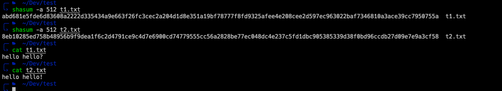
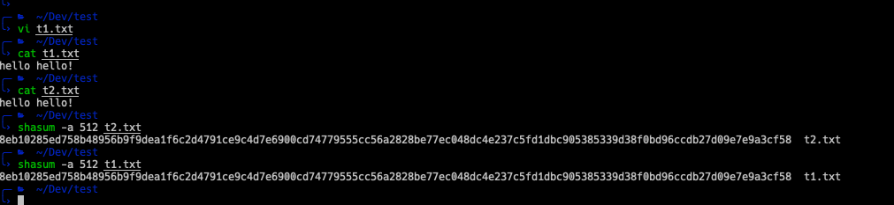

## 什么是 checksums

校验和是一种数据有效性的检测手段，A checksum is a sequence of numbers and letters used to check data for errors. 
If you know the checksum of an original file, you can use a checksum utility to confirm your copy is identical.

用来检验copy of file 是不是 和 原文件 相同 identical. 

## 何时使用 checksums

You can use checksums to check files and other data for errors that occur during transmission or storage. 
For example, a file might not have properly downloaded due to network issues, or hard drive problems could have caused corruption in a file on disk.
If you know the checksum of the original file, you can run a checksum or hashing utility on it. If the resulting checksum matches, you know the file you have is identical.

## 如何使用 checksums

参考文章 使用 checksum https://medium.com/@EvgeniIvanov/how-to-verify-checksum-on-mac-988f166b0c4f 
